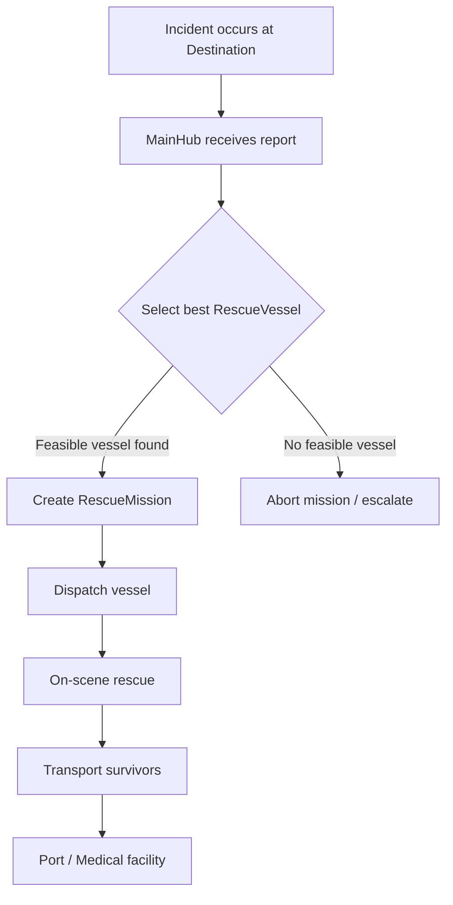
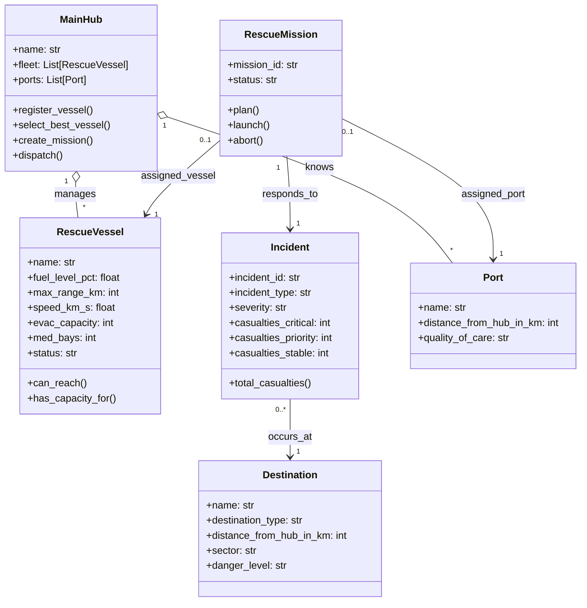

Download Instructions
1. Make a new directory and cd to it.

Windows (Git Bash)
```
git clone https://github.com/winkylocc/deep-space-rescue-service.git
cd deep-space-rescue-service
python --version
python -m main
```

Mac Terminal

```
git clone https://github.com/winkylocc/deep-space-rescue-service.git
cd deep-space-rescue-service
python3 --version
python3 -m main
```

If you don't have Python, they install Python 3 from python.org.
---
### To add code:
Create a Feature Branch
Before making changes, create a new branch from main:

```
git checkout main
git pull origin main
git checkout -b feature/your-feature-name
```

Example:
```
git checkout -b feature/incident-reporting
```
Make Your Changes

Edit the code, then stage and commit:
```
git add .
git commit -m "Add incident reporting feature"
```
Push the Branch

Push the branch to the remote repository:
```
git push origin feature/your-feature-name
```
Create a Pull Request

Go to the repository on GitHub.

Click Compare & pull request.

Add a description of your changes.

Submit the Pull Request.

The pull reques should be merged into main unless unresolved errors exists.
Examples branch names
```
feature/incident-reporting
feature/vessel-dispatch
feature/user-input-validation
bugfix/incident-import
docs/readme-update
```
---

## Visual architecture diagram for Deep Space Rescue Service



### ENTITIES


